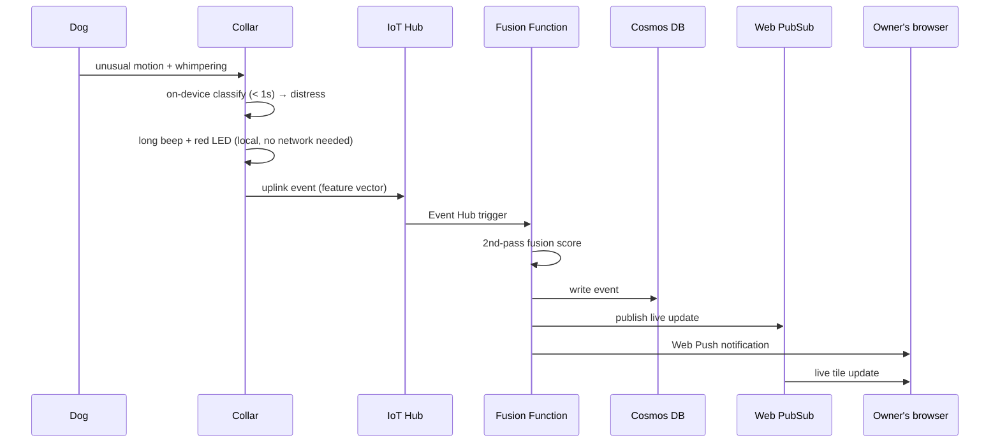
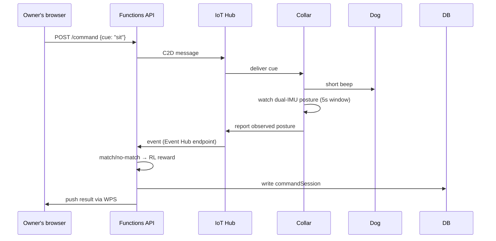

# PetPulse (Bandhan) — System Design Document

Team: **Origami Treats**
Status: v1 — companion **website** + Azure backend + ESP32 collar firmware
Source of truth for product scope: PetPulse PRD (see README for link). This doc translates that PRD into a concrete, buildable architecture.

---

## 1. Design Goals (from PRD, restated as engineering constraints)

| PRD requirement | Engineering constraint |
|---|---|
| Alert-to-notification latency < 10s | Local (on-collar) detection must complete in < 1s; cloud round-trip budget ≤ 9s |
| False positives ≤ 1/dog/day | Two-stage detection (cheap on-device filter → richer cloud fusion) before any push fires |
| Battery 18–24h continuous | Duty-cycled sampling + interrupt-driven wake, not constant full-rate sampling |
| No raw audio ever leaves the collar | Only feature vectors (MFCC-like summaries / classifier output) cross the network |
| Per-dog baseline, not a global model | Baseline state lives per-device/per-dog, cold-start window before alerting turns on |
| Cost-efficient, low-latency backend | Serverless / consumption-priced Azure services, free tiers wherever the pilot fits inside them |

---

## 2. High-Level Architecture

```mermaid
flowchart LR
    subgraph Collar["Collar (ESP32)"]
        IMU1[MPU6050 #1]
        IMU2[MPU6050 #2]
        MIC[Condenser Mic]
        BUZ[Buzzer]
        LED[Status LED]
        TinyML[On-device classifier\n+ rolling baseline]
        IMU1 --> TinyML
        IMU2 --> TinyML
        MIC --> TinyML
        TinyML -- local anomaly --> BUZ
        TinyML -- status --> LED
    end

    Collar -- WiFi/MQTT, feature vectors + events --> IoT[Azure IoT Hub]
    IoT -- C2D message: beep cue --> Collar

    IoT -- built-in Event Hub endpoint --> FnFuse[Azure Function: fusion + 2nd-pass scoring]
    FnFuse --> Cosmos[(Cosmos DB\nevents / baselines / dogs / devices)]
    FnFuse --> PubSub[Azure Web PubSub]
    FnFuse --> Push[Web Push (VAPID)]

    Cosmos --> FnApi[Azure Functions API\n(co-located with SWA)]
    FnApi --> SWA[Azure Static Web App\nReact/Next.js dashboard]
    PubSub -- live event stream --> SWA
    Push -- browser notification --> Owner[Owner's browser/device]

    SWA -- owner sends cue --> FnApi --> IoT

    Blob[(Blob Storage\ndaily rollups, cool/archive tier)]
    Cosmos -- nightly rollup --> Blob
    Job[Container Apps Job\nweekly retrain, scale-to-zero] --> Cosmos
    Job --> Blob

    KV[Key Vault] -.secrets.-> FnFuse
    KV -.secrets.-> FnApi
    AI[App Insights] -.telemetry.-> FnFuse
    AI -.telemetry.-> FnApi
```

**Why this shape:** the collar never blocks on the network for its own alert (buzzer fires off the on-device model alone). Everything cloud-side exists to (a) double-check the on-device call with a richer model, (b) give the owner a website instead of a walkie-talkie, and (c) accumulate history for the trend-based use cases (senior dog, recovery monitoring) later.

---

## 3. Component Breakdown

### 3.1 Collar firmware (ESP32)
- **Sampling loop:** IMUs polled at a low idle rate (~10–20 Hz); MPU6050's built-in motion-interrupt pin wakes the ESP32 from light sleep on movement above a threshold, avoiding constant CPU-side polling. Mic sampled in short windows (e.g. 1s every 5s idle, continuous during a motion event) rather than a continuous stream.
- **On-device model:** a small TFLite-Micro classifier (posture/anomaly from dual-IMU fusion; vocal-pattern class from mic features) running against a rolling per-dog baseline stored in flash/NVS. Output: `normal | minor_anomaly | distress` + a posture label (`sit | stand | lie_down | unknown`) for the command loop.
- **Baseline builder:** exponentially-weighted rolling stats (mean/variance of motion energy, rest duration, bark rate) updated continuously; first 3–7 days flagged internally as `learning` — see [§7.2](#72-baseline-cold-start).
- **Local alerting:** `minor_anomaly` → short beep + amber LED (logged only). `distress` → long beep + red LED **and** immediate uplink attempt (this is the one path that doesn't wait for a batching window).
- **Command loop:** listens for a C2D message (`{"cue":"sit"}` or `{"cue":"come"}`), plays the corresponding beep pattern, watches IMU posture for a configurable window (e.g. 5s), reports the observed posture back as a device-to-cloud event for RL reward scoring.
- **Uplink payload:** small JSON/CBOR feature-vector events, never raw audio samples — e.g. `{deviceId, ts, class, confidence, postureVec, vocalFeatures}`.
- **Connectivity:** WiFi + MQTT to IoT Hub (see [§4](#4-why-iot-hub-and-not-something-else)). BLE considered and rejected as the primary uplink — see [§7.7](#77-connectivity-choice).

### 3.2 Ingestion (Azure IoT Hub)
- One **device identity per collar**, provisioned manually from the dashboard for pilot scale (see [§7.9](#79-device-provisioning)).
- Device-to-cloud: telemetry + events, routed to the built-in Event Hub-compatible endpoint.
- Cloud-to-device: the beep-cue command loop, and pushed threshold/sensitivity updates via **device twins** (owner changes sensitivity in the dashboard → twin property update → collar picks it up next check-in, no custom sync protocol needed).

### 3.3 Fusion function (Azure Functions, Consumption plan)
- Triggered per incoming event batch from IoT Hub's Event Hub endpoint.
- Runs the heavier fusion model (motion + vocal-pattern → single distress confidence), since the on-device model is intentionally small.
- On `distress` (post-fusion): writes the event to Cosmos DB, publishes to Web PubSub (live dashboard tile), and sends a Web Push notification.
- On `minor_anomaly`: writes to Cosmos DB only, no push — matches the PRD's alert-tier table.

### 3.4 Data store (Cosmos DB, NoSQL API, free tier)
Containers, all partitioned by `dogId` for query locality:
- `dogs` — profile, breed/age (used to seed default thresholds), owner link.
- `devices` — collar ↔ dog binding, firmware version, battery/last-seen.
- `events` — every flagged anomaly/distress/command-outcome, source of the activity feed and trend charts.
- `baselines` — periodic snapshots of the rolling baseline (for the "how has this dog's normal changed" view, and for debugging model drift).
- `commandSessions` — cue sent, posture observed, match/no-match, feeds the RL reward log.

### 3.5 Companion website (Azure Static Web Apps)
- React/Next.js dashboard: live status tile, activity/vocal-pattern trend charts, event feed, sensitivity + quiet-hours settings, command-cue buttons (send "sit"/"come to owner", see result).
- SWA's **built-in auth** (GitHub/Google/Microsoft providers) handles owner login — no separate auth service needed at this scale.
- Co-located Functions (`/api`) serve the dashboard's REST calls; deploys in the same GitHub Actions pipeline as the frontend.
- Subscribes to Azure Web PubSub for live tile updates instead of polling.

### 3.6 ML / retraining (Azure Container Apps Jobs, consumption/scale-to-zero)
- A scheduled weekly job re-fits the fusion model using Cosmos DB events + owner-marked accurate/false feedback, and Blob-archived Kaggle-seeded base dataset.
- Deliberately **not** a full Azure ML workspace for MVP — the model is small enough that a scheduled script in a scale-to-zero container is materially cheaper and simpler to operate; Azure ML is a documented Phase-2 upgrade path once retraining needs experiment tracking/hyperparameter sweeps at scale.

---

## 4. Why IoT Hub and not something else

Considered: raw MQTT broker on a VM, Azure Event Hubs directly, Azure Web PubSub for ingestion too.

IoT Hub wins for this specific product because it gives three things the alternatives make you build by hand:
1. **Per-device identity + auth** (SAS tokens/X.509) — needed anyway once there's more than one collar.
2. **Cloud-to-device messaging** — this *is* the command-loop transport (owner → cue → collar), not a bolted-on feature.
3. **Device twins** — free, built-in sync for per-dog sensitivity/threshold settings, replacing what would otherwise be a custom config-push protocol.

Free tier (F1: 8,000 msgs/day, 1 unit per subscription) comfortably covers a handful of pilot collars sending duty-cycled events (not raw streams). Cost only becomes real when scaling past pilot — at that point, upgrade tier, not architecture.

---

## 5. API Surface (Functions API behind the website)

| Endpoint | Method | Purpose |
|---|---|---|
| `/api/dogs` | GET/POST | List/register dogs for the logged-in owner |
| `/api/dogs/{id}/events` | GET | Paginated event feed (filters: severity, date range) |
| `/api/dogs/{id}/baseline` | GET | Current baseline summary + trend series |
| `/api/dogs/{id}/settings` | GET/PUT | Sensitivity, quiet hours → writes IoT Hub device twin |
| `/api/dogs/{id}/command` | POST | Send a cue (`sit`/`come`) → IoT Hub C2D message |
| `/api/dogs/{id}/command-sessions` | GET | History of cue → posture-match outcomes |
| `/api/events/{id}/feedback` | POST | Owner marks alert accurate/false → retrain signal |
| `/api/devices/{id}/status` | GET | Battery, last-seen, connectivity state |

Realtime (no polling): the dashboard opens a Web PubSub connection on load and receives push messages for new events/battery/status changes.

---

## 6. Sequence Diagrams

### 6.1 Passive distress detection → alert


### 6.2 Command-training loop


---

## 7. Edge Cases & Failure Handling

### 7.1 Connectivity loss
The collar must never depend on the network for its *own* alert — the buzzer fires from the on-device model alone. Uplink events queue in a small on-device ring buffer (bounded, oldest-dropped-first) and flush on reconnect with original timestamps preserved, so the dashboard's history stays accurate even after an offline gap.

### 7.2 Baseline cold-start
For the first 3–7 days per dog, the dashboard shows a "learning your dog" state. Anomaly *logging* is still active (for later trend review) but push notifications are suppressed except for extreme motion-energy outliers (a hard ceiling independent of the not-yet-reliable baseline), so a genuinely dangerous event still surfaces even on day one.

### 7.3 False-positive throttling
Per-dog rate limit (configurable, default: max 1 push/hour outside of `distress`-tier events) plus a cooldown window after any alert — repeated borderline readings within the cooldown are logged, not re-pushed, until the dog returns to baseline.

### 7.4 "Come to owner" without GPS
MVP has no GPS. Resolved for MVP as: "come to owner" verification uses IMU posture (an approach/settle posture near the collar's last-known-still position) as a **best-effort** proxy, not true owner-location matching. This is called out explicitly as a known limitation in the dashboard's command-result UI ("approximate match") rather than silently overstating confidence.

### 7.5 Multi-collar / multi-dog households
`dogId` and `deviceId` are separate from day one (device is a swappable asset; dog is the durable identity) even though MVP is single-dog, so multi-dog support (Phase 2) is a UI/query change, not a data-model migration.

### 7.6 Battery
Duty-cycled sampling + interrupt-driven wake (see §3.1) is the primary lever. Below 15% battery: collar sends a one-time low-battery event (push-worthy, since an unmonitored dog is the exact failure mode this product exists to prevent) and drops to a reduced-rate "safety mode" sampling profile to stretch remaining runtime.

### 7.7 Connectivity choice (BLE vs WiFi)
WiFi + MQTT chosen for the primary uplink: BLE's range ties monitoring to "phone near the dog," which defeats the "owner is out of the house" use case. BLE is kept only as an optional short-range provisioning/config channel (setting WiFi credentials on a new collar), not the telemetry path.

### 7.8 Clock drift
Collar syncs time via NTP on every WiFi connect; events carry the synced timestamp, not raw device uptime, so offline-buffered events reorder correctly once flushed.

### 7.9 Device provisioning
Manual registration via the dashboard (owner enters a code printed on the collar) for pilot scale — Azure IoT Hub Device Provisioning Service (DPS) is the documented Phase-2 upgrade once onboarding needs to be zero-touch at volume; skipping it now avoids an extra billable service with no pilot-scale benefit.

### 7.10 Privacy / data retention
Raw audio never leaves the collar (feature vectors only, enforced in firmware, not just policy). Cosmos DB event retention default: 90 days hot, then rolled into Blob (cool → archive tier via lifecycle policy) for the long-term trend use cases; raw feature-vector granularity is not kept indefinitely, only daily rollups past the 90-day window.

---

## 8. Security

- TLS 1.2 enforced end-to-end (IoT Hub default; SWA/Functions default).
- Per-device SAS tokens for collar↔IoT Hub auth, rotated on provisioning.
- Functions use **managed identity** to reach Cosmos DB / Key Vault — no connection strings in code or config.
- Key Vault holds IoT Hub service connection string, Web Push VAPID keys.
- SWA built-in auth scopes every API call to the logged-in owner's own `dogId`s (checked server-side in Functions, not just hidden in the UI).
- CORS locked to the SWA origin.

---

## 9. Cost Shape (pilot scale, few collars)

| Service | Tier | Expected pilot cost |
|---|---|---|
| IoT Hub | F1 Free | $0 |
| Functions | Consumption | ~$0 (well within monthly free grant) |
| Cosmos DB | Free tier (1000 RU/s, 25GB) | $0 |
| Blob Storage | Cool/Archive | pennies/month |
| Static Web Apps | Free | $0 |
| Web PubSub | Free (20 connections) | $0 |
| Web Push | Standard (VAPID, no Azure service) | $0 |
| Key Vault | Pay-per-operation | pennies/month |
| Container Apps Jobs | Consumption, scale-to-zero | pennies per weekly run |
| App Insights | Free tier grant | $0 |

Whole pilot stack is designed to run at **effectively $0/month** until real scale forces a tier upgrade — at which point it's a tier change, not a re-architecture.

---

## 10. Explicit non-goals for this version
- No GPS/geofencing (Phase 2 — needed for real "come to owner" verification and escape detection).
- No voice-word playback — beep-only cues (Phase 2 needs an audio-output module, not yet in the BOM).
- No smell-based triggers, no heart-rate sensing (Phase 2, per PRD).
- No native mobile app — website only for this build.
- No multi-tenant/B2B (daycare/vet) views — data model allows for it later, UI doesn't expose it yet.
