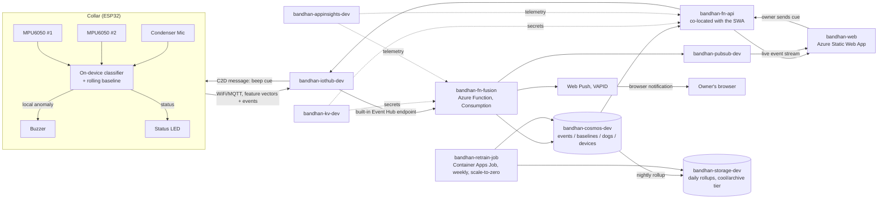

# Pawse (formerly PetPulse / Bandhan) — System Design Document

Team: **Origami Treats**
Status: v1 — companion **website** + Azure backend + ESP32 collar firmware
Source of truth for scope: [PRD.md](./PRD.md). This doc is the engineering expansion — it does not invent requirements the PRD doesn't have.

> Renamed from PetPulse/Bandhan to **Pawse**. Every resource name below (`bandhan-*`, `rg-bandhan-dev`) was provisioned before the rename and is already live — Cosmos DB, IoT Hub, and Function Apps can't be renamed in place, so migrating them to `pawse-*` means recreating each one and copying data across. That's a deliberate, separate decision, not done as part of this rename.

---

## 1. Design goals (from the PRD, restated as engineering constraints)

| PRD requirement | Engineering constraint |
|---|---|
| Alert-to-notification latency < 10s (PRD §13) | Local (on-collar) detection completes in < 1s; cloud round-trip budget ≤ 9s |
| False positives ≤ 1/dog/day (PRD §13) | Two-stage detection (cheap on-device filter → richer cloud fusion) before any push fires |
| Battery 18–24h continuous (PRD §13, §15) | Duty-cycled sampling + interrupt-driven wake, not constant full-rate sampling |
| No raw audio ever leaves the collar (PRD §5 rule 1) | Enforced in firmware: only feature vectors cross the uplink, never audio samples |
| Per-dog baseline, not a global model (PRD §5 rule 3) | Baseline state keyed by `dogId`, cold-start window before alerting turns on |
| One owner, one dog, one collar (PRD §15) | Data model still separates `deviceId` from `dogId` from day one — see §5 — so Phase 2 multi-dog is a query change, not a migration |
| "Come to owner" has no GPS (PRD §5 rule 5) | Posture-only verification, result explicitly labeled approximate end-to-end, not just in the UI copy |
| Cost-efficient, low-latency backend | Serverless / consumption-priced Azure services, free tiers wherever the pilot fits inside them |

---

## 2. High-level architecture

**Why this shape:** the collar never blocks on the network for its own alert — the buzzer fires from the on-device model alone (PRD §5 rule 4). Everything cloud-side exists to (a) double-check the on-device call with a richer model, (b) serve the website instead of a native app, and (c) accumulate history for Phase-2 trend use cases.

---

## 3. Services and ownership

Nothing here is deployed yet — these are the planned resource names for `rg-bandhan-dev` (`centralindia`, chosen for lowest latency to a pilot in India; revisit if the pilot moves), so the first deploy has a fixed naming convention rather than one improvised per-service later.

| Component | Azure resource (planned name) | Owns |
|---|---|---|
| Ingestion + device commands | IoT Hub, `bandhan-iothub-dev` (F1 free tier) | Device identity/auth, D2C telemetry, C2D beep-cue messages, device twins for sensitivity settings |
| Fusion function | Function App, `bandhan-fn-fusion` (Consumption) | Second-pass motion+vocal fusion scoring, writes events, triggers push |
| Data store | Cosmos DB (NoSQL API), `bandhan-cosmos-dev` (free tier: 1000 RU/s, 25GB) | `dogs`, `devices`, `events`, `baselines`, `commandSessions` containers — see §5 |
| Realtime push to website | Web PubSub, `bandhan-pubsub-dev` (free tier: 20 connections) | Live dashboard tile updates |
| Website + API | Static Web App, `bandhan-web` (free tier) + co-located Functions (`bandhan-fn-api`) | React/Next.js dashboard, REST API behind it (§7), built-in owner auth |
| Archive | Storage Account, `bandhan-storage-dev` (cool/archive lifecycle) | Daily rollups past the 90-day hot retention window |
| Retraining | Container Apps Job, `bandhan-retrain-job` (consumption, scale-to-zero) | Weekly scheduled retrain using Cosmos events + owner feedback + Blob-archived base dataset |
| Secrets | Key Vault, `bandhan-kv-dev` | IoT Hub service connection string, Web Push VAPID keys |
| Telemetry | Application Insights, `bandhan-appinsights-dev` | Function + SWA logs/metrics |

---

## 4. Why IoT Hub and not something else

Considered: raw MQTT broker on a VM, Azure Event Hubs directly, Azure Web PubSub for ingestion too.

IoT Hub wins for this specific product because it gives three things the alternatives make you build by hand:

1. **Per-device identity + auth** (SAS tokens/X.509) — needed anyway once there's more than one collar.
2. **Cloud-to-device messaging** — this *is* the command-loop transport (PRD FR-5.1), not a bolted-on feature.
3. **Device twins** — free, built-in sync for per-dog sensitivity/threshold settings (PRD FR-6.3), replacing what would otherwise be a custom config-push protocol.

Free tier (F1: 8,000 msgs/day, 1 unit per subscription) comfortably covers a handful of pilot collars sending duty-cycled events, not raw streams. Cost only becomes real at scale — that's a tier upgrade, not a re-architecture.

---

## 5. Data model (Cosmos DB, NoSQL API)

All containers partitioned by `dogId` for query locality. `deviceId` and `dogId` are separate fields from day one — see PRD §15 (one owner/dog/collar in v1) and the constraint row in §1: this keeps Phase-2 multi-dog a query change, not a data migration.

| Container | Partition key | Shape (informal) |
|---|---|---|
| `dogs` | `/dogId` | name, breed, age, temperament, ownerId |
| `devices` | `/dogId` | deviceId, firmwareVersion, batteryPct, lastSeenAt |
| `events` | `/dogId` | timestamp, class (`minor_anomaly`\|`distress`\|`low_battery`\|`sustained_stillness`), confidence, sourceSignals, feedback (`accurate`\|`false`\|unset) |
| `baselines` | `/dogId` | rolling motion-energy mean/variance, rest-duration pattern, bark-rate pattern, `learning` flag, snapshot timestamp |
| `commandSessions` | `/dogId` | cue (`sit`\|`come`), timestamp, observedPosture, matchResult (`match`\|`no_match`\|`approximate_match`\|`timeout`) |
| `owners` | `/ownerId` | name, unique email, bcrypt passwordHash, pushSubscriptions (Web Push subscription objects) — added during implementation; PRD §6 defines Owner but the original container table (this section) omitted it |

`matchResult` carries `approximate_match` as a distinct value (not folded into `match`) specifically so the website can render PRD FR-5.2's "approximate, not location-confirmed" requirement from the data itself, not from UI-only copy that could drift out of sync.

---

## 6. Data flow — passive detection to alert

1. Dog moves/vocalizes → both MPU6050 units + mic feed the ESP32's on-device classifier (< 1s).
2. On `distress`: buzzer fires (long beep) and LED goes red — **this step has no network dependency** (PRD §5 rule 4).
3. Collar uplinks the feature-vector event over WiFi/MQTT to `bandhan-iothub-dev` (device-to-cloud).
4. IoT Hub's built-in Event Hub-compatible endpoint triggers `bandhan-fn-fusion`.
5. The function re-scores with the richer fusion model (motion + vocal → one confidence value) and writes the result to the `events` container in `bandhan-cosmos-dev`.
6. On `distress` (post-fusion): the function publishes to `bandhan-pubsub-dev` (live dashboard tile) and sends a Web Push notification. On `minor_anomaly`: Cosmos write only, no push — matches PRD §12's alert-tier table exactly.
7. The owner's browser, already holding a Web PubSub connection from `bandhan-web`, updates the dashboard tile without polling; the Web Push notification lands even if the tab is closed.

## 6.1 Data flow — command-training loop

1. Owner clicks "sit" or "come to owner" on the Command page → `POST /api/dogs/{id}/command` on `bandhan-fn-api`.
2. The function sends a cloud-to-device message to `bandhan-iothub-dev` targeting that `deviceId`.
3. IoT Hub delivers it to the collar (assuming it's online — see §9.3 for the offline case).
4. Collar plays the corresponding beep, watches dual-IMU posture for a configurable window, and uplinks the observed posture as a device-to-cloud event.
5. `bandhan-fn-fusion` computes match/no-match/approximate-match/timeout, writes a `commandSessions` document, and pushes the result to the website over `bandhan-pubsub-dev`.
6. The match outcome is the reward signal for the RL update in `bandhan-retrain-job`'s next scheduled run — the loop doesn't retrain synchronously per trial.

---

## 7. API surface (`bandhan-fn-api`, behind the website)

| Endpoint | Method | Purpose |
|---|---|---|
| `/api/dogs` | GET/POST | List/register dogs for the logged-in owner |
| `/api/dogs/{id}/events` | GET | Paginated event feed (filters: severity, date range) |
| `/api/dogs/{id}/baseline` | GET | Current baseline summary + trend series |
| `/api/dogs/{id}/settings` | GET/PUT | Sensitivity, quiet hours → writes IoT Hub device twin |
| `/api/dogs/{id}/command` | POST | Send a cue (`sit`/`come`) → IoT Hub C2D message |
| `/api/dogs/{id}/command-sessions` | GET | History of cue → posture-match outcomes |
| `/api/events/{id}/feedback` | POST | Owner marks alert accurate/false → retrain signal |
| `/api/devices/{id}/status` | GET | Battery, last-seen, connectivity state |

Realtime (no polling): the dashboard opens a Web PubSub connection on load and receives push messages for new events/battery/status changes.

---

## 8. Identity & secrets

- Collar ↔ IoT Hub: per-device SAS token, rotated on (re-)provisioning (§9.4).
- `bandhan-fn-fusion` and `bandhan-fn-api` use **system-assigned managed identities** to reach `bandhan-cosmos-dev` and `bandhan-kv-dev` — no connection strings in code or app settings.
- `bandhan-kv-dev` holds the IoT Hub service connection string (used to send C2D messages) and the Web Push VAPID key pair.
- Owner auth is email + password (bcrypt hash, server-enforced strong-password policy) issuing a 7-day JWT from `bandhan-fn-api` — implemented ahead of `bandhan-web`'s built-in-provider plan below, since there's no website yet to redirect through and no dedicated Google Cloud project designated for an OAuth client. Every `bandhan-fn-api` call resolves `ownerId` from that JWT server-side and checks it against the target `dog.ownerId`, not just hiding it in the UI. Revisit `bandhan-web`'s built-in authentication (GitHub/Google/Microsoft providers) once the website exists — the JWT model can sit behind it or be replaced by it.
- CORS on `bandhan-fn-api` locked to the `bandhan-web` origin.
- TLS 1.2 enforced end-to-end (IoT Hub and Static Web Apps default to this; not something to configure separately).

---

## 9. Edge cases and failure handling

Numbered against the PRD's own edge-case list (PRD §14) where they overlap; this section is the *how*, not a restatement of the *what*.

### 9.1 Connectivity loss (PRD §14 "Connectivity")
The collar's own beep never depends on the network (§1, §6 step 2). Uplink events queue in a small on-device ring buffer (bounded, oldest-dropped-first) and flush on reconnect with original timestamps preserved, so `bandhan-cosmos-dev` history stays accurate across an offline gap rather than showing a silent hole.

### 9.2 Baseline cold-start (PRD §14 "Baseline / detection", FR-4.2)
`baselines.learning = true` for the first 3–7 days. `bandhan-fn-fusion` still writes events during this window but suppresses the push step unless motion-energy crosses a hard ceiling independent of the (not-yet-reliable) baseline — so a genuinely dangerous day-one event still surfaces.

### 9.3 Command cue sent while collar is offline (PRD §14 "Command loop")
`POST /api/dogs/{id}/command` still succeeds (the C2D message queues at IoT Hub, which holds it for delivery). If the collar doesn't come online within a configurable window, the function writes `commandSessions.matchResult = "timeout"` and pushes that result — never a false `no_match`, per PRD's explicit requirement that a timeout must not read as "the dog ignored it."

### 9.4 "Come to owner" without GPS (PRD §5 rule 5, §14)
`matchResult` distinguishes `approximate_match` from `match` at the data layer (§5), not only in UI copy — so no future feature can accidentally present posture-only verification as location-confirmed.

### 9.5 False-positive throttling (PRD §14 "Alerting")
Per-dog rate limit (default: max 1 push/hour outside `distress`-tier events) plus a cooldown window after any alert. Readings inside the cooldown are logged, not re-pushed.

### 9.6 Multi-collar readiness without building multi-dog now
`deviceId` and `dogId` are separate containers from day one (§5) even though PRD §15 scopes v1 to one owner/one dog/one collar — this is the one place the implementation intentionally carries a small amount of Phase-2-readiness, because retrofitting it later would be a data migration, not a query change.

### 9.7 Battery (PRD §13, §14 "Battery")
Duty-cycled sampling + interrupt-driven wake (MPU6050's motion-interrupt pin wakes the ESP32 from light sleep, rather than constant polling) is the primary lever for the 18–24h target. Below 15%: one-time low-battery event, pushed even if it's an extra alert above the false-positive budget — PRD explicitly ranks "unmonitored dog" above "alert fatigue" for this one case.

### 9.8 Connectivity choice (WiFi, not BLE)
WiFi + MQTT is the uplink. BLE was considered and rejected: its range ties monitoring to "phone near the dog," which defeats the "owner is out of the house" use case the whole product exists for (PRD §17 locked decision).

### 9.9 Clock drift
Collar syncs time via NTP on every WiFi connect; events carry the synced timestamp, not raw device uptime, so buffered-and-flushed events (§9.1) reorder correctly.

### 9.10 Device provisioning (deferred, not solved)
Manual registration via the website (owner enters a code printed on the collar) for pilot scale. Azure IoT Hub's Device Provisioning Service (DPS) is the Phase-2 path once onboarding needs to be zero-touch at volume — skipping it now avoids a billable service with no pilot-scale benefit, not an oversight.

### 9.11 Privacy / retention (PRD §5 rule 1, §15)
Raw audio never leaves the collar — enforced in firmware, not policy. Cosmos DB event retention: 90 days hot, then rolled into `bandhan-storage-dev` (cool → archive tier via lifecycle policy). Feature-vector granularity is not kept indefinitely — only daily rollups survive past the 90-day window.

---

## 10. Security

- TLS 1.2 enforced end-to-end (IoT Hub and Static Web Apps defaults).
- Per-device SAS tokens for collar↔IoT Hub auth, rotated on provisioning.
- Managed identities for Cosmos DB / Key Vault access from both Functions — see §8.
- SWA built-in auth scopes every API call to the logged-in owner's own data — checked server-side, not just hidden in the UI.
- CORS locked to the SWA origin.

---

## 11. Cost shape (pilot scale, few collars)

| Service | Tier | Expected pilot cost |
|---|---|---|
| IoT Hub | F1 Free | $0 |
| Functions (fusion + API) | Consumption | ~$0 (within monthly free grant) |
| Cosmos DB | Free tier (1000 RU/s, 25GB) | $0 |
| Storage (archive) | Cool/Archive | pennies/month |
| Static Web Apps | Free | $0 |
| Web PubSub | Free (20 connections) | $0 |
| Web Push | Standard VAPID, no Azure service | $0 |
| Key Vault | Pay-per-operation | pennies/month |
| Container Apps Jobs | Consumption, scale-to-zero | pennies per weekly run |
| App Insights | Free tier grant | $0 |

Whole pilot stack is designed to run at **effectively $0/month** until real scale forces a tier upgrade — a tier change, not a re-architecture.

---

## 12. Known simplifications (follow-ups before this is a real pilot, not a demo)

Stated plainly rather than glossed over, so nobody mistakes "not built yet" for "solved":

- **No device provisioning service.** Manual code-entry pairing (§9.10) doesn't scale past a handful of collars; add DPS before onboarding beyond a pilot.
- **No OTA firmware updates.** A firmware bug on a deployed collar currently means physically retrieving it. Fine for a pilot with a handful of units in hand; not fine at real scale.
- **No multi-tenant isolation testing.** The API scopes by owner (§8) but this hasn't been adversarially tested — do that before any real user's data sits next to another's, even though v1 is one-owner-per-collar by design (§9.6 note).
- **Cloud fusion model is a placeholder shape, not a trained model yet.** §6 describes the pipeline; the actual classifier (Kaggle-seeded + per-dog baseline, PRD §17) still needs to be built and evaluated against PRD §13's recall/false-positive targets before this is more than an architecture.
- **IoT Hub free tier is a hard cap (8,000 msgs/day, 1 free instance/subscription).** Fine for a pilot; the first thing to check before adding a second collar to the same subscription.
- **Retrain job has no rollback.** A bad weekly retrain currently just ships — add a held-out validation gate before promoting a new model version, once there's a real model to protect.
